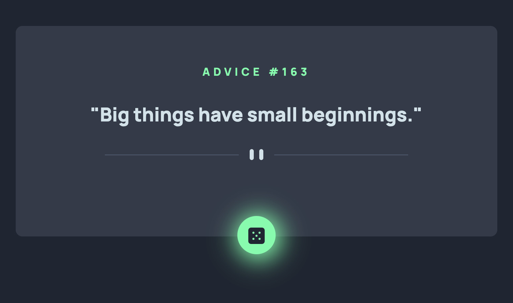

# Frontend Mentor - Advice generator app

The perfect project if you're learning how to interact with 3rd-party APIs. This challenge uses the Advice Slip API to generate random quotes of advice.

## Table of contents

- [Overview](#overview)
  - [The challenge](#the-challenge)
  - [Screenshot](#screenshot)
  - [Links](#links)
  - [Built with](#built-with)
  - [What I learned](#what-i-learned)
- [Author](#author)

## Overview

### Links

- Solution URL: [Check it out](https://advicesapp.netlify.app/)

### Built with

- Semantic HTML5 markup
- CSS custom properties
- Flexbox
- Mobile-first workflow
- JavaScript
- Fetch [Advice Slip API](https://api.adviceslip.com/) 

### What I learned

I learned how to fetch the Advice Slip API in order to show many different and random advices. In order to do that, I used the fetch method but I have also played around with the axios library. Feel free to explore whatever is best/easier for you.

## Author

- Website - [www.cristina-padilla.com](https://www.cristina-padilla.com)
- Frontend Mentor - [Cristina Padilla](https://www.frontendmentor.io/profile/Mama-simba)
- Twitter - [@crispitipina](https://www.twitter.com/crispitipina)

